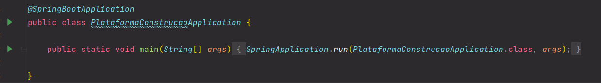

# MO 02 - Configuração do Backend

## Dependências

O projeto utiliza o maven, portanto o primeiro passo é realizar o [download](https://maven.apache.org/download.cgi?Preferred=ftp%3A%2F%2Fmirror.reverse.net%2Fpub%2Fapache%2F) ou configurar a IDE para utilizar um wrapper.

Então, é necessário realizar o download da JDK a ser utilizada, no nível 17. A build recomendada é a [Liberica](https://bell-sw.com/pages/downloads/).

Para utilizar a JDK com o maven, configure a variável de sistema `JAVA_HOME`, o que pode ser feito temporariamente no windows (utilizando [Git Bash](https://git-scm.com/downloads)) com o comando:

```bash
$ set JAVA_HOME="C:\caminho\para\jdk"
```

Em seguida, é necessário configurar o banco de dados e adicionar os dados para a conexão.

## Configurando o Banco

O SGBD utilizado é o [PostgreSQL 15.2](https://www.enterprisedb.com/downloads/postgres-postgresql-downloads).

Após a instalação, execute o `psql` pelo atalho no windows ou inicie pela CLI com o comando

```bash
$ psql -h localhost -p 5432 -U postgres
```

Em seguida, crie um novo usuário e a database:
```bash
postgres-# create role <username> with login superuser password '<senha>';
postgres-# create database plataforma_construcao;
```

Para executar queries no banco, configure algum client GUI como o pgAdmin, ou realize a conexão no psql com o comando:
```bash
postgres-# \c plataforma_construcao felipe_scheffel;
```
ou, para iniciar diretamente conectado:
```bash
$ psql -h localhost -p 5432 -U <username> -d plataforma_construcao
```

## Conectando o Java com o Postgres

No arquivo `resources/application.properties`, adcione/altere as seguintes propriedades:

```properties
spring.datasource.url=jdbc:postgresql://localhost:5432/plataforma_construcao
spring.datasource.username=<username>
spring.datasource.password=<senha>
```

## Execução

Utilizando uma instalação standalone do maven:
```bash
$ mvn clean spring-boot:run
```

Utilizando o wrapper:
```bash
$ ./mvn clean spring-boot:run
```

Ou adicione uma run configuration para a `main` da classe `PlataformaConstrucaoApplication`:



O endpoint será executado na porta 8080.